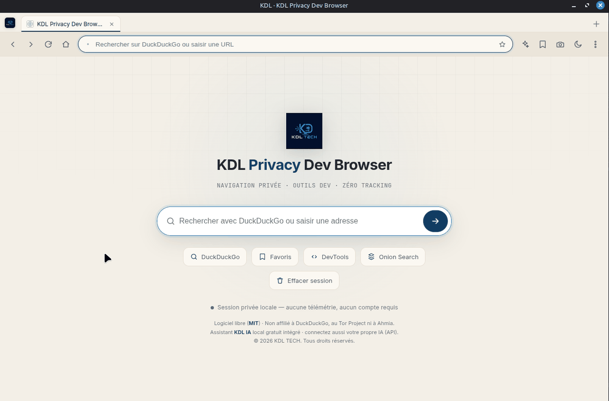

[Français](README.md) · **English**

# KDL Privacy Dev Browser

A desktop browser that does not watch you, and that already carries the tools you always
end up installing as extensions: page inspection, one-click site-data wipe, full-page
screenshot, reading mode, quick audit.

```bash
git clone https://github.com/Kdl-Tech/kdl-privacy-dev-browser.git
cd kdl-privacy-dev-browser && npm install && npm start
```



*The interface is in French.*

## What it does

| | |
|---|---|
| **Private browsing** | DuckDuckGo by default, minimal local history you can disable, clear-on-close, optional third-party cookie blocking, no telemetry |
| **Developer tools** | page DevTools, one-click site-data wipe (cookies, cache, local/sessionStorage), full-page screenshot, desktop/tablet/mobile modes, page info panel (URL, title, domain, HTTPS, user agent) |
| **Quick audit** | title, meta description, H1 presence, HTTPS, images missing `alt`, external links, overall verdict |
| **Reading mode** | clean extraction, three themes, adjustable size and width, reading time, Markdown export, PDF printing |
| **Optional local AI** | small local model, optional Ollama backend, or your own API key — the browser works entirely without any AI |
| **Onion Search** | search through the public Ahmia index, handing off to Tor Browser |
| **Updates** | through GitHub Releases (electron-updater) |

## .onion addresses do not open here

An ordinary Chromium browser, handed a `.onion` address, will try to resolve it through
regular DNS. The hidden service stays unreachable, of course — but the query has already
left in the clear, to your resolver and then to your ISP. The only thing the attempt
accomplished was announcing what you were looking for.

So this browser never makes that attempt. A `.onion` address typed in the bar raises a
warning and offers the one correct option: hand off to Tor Browser if it is installed on
the machine. The Onion Search panel queries Ahmia's **public** index over ordinary HTTPS —
a regular web page, not access to the Tor network.

## Electron hardening

`contextIsolation: true` · `nodeIntegration: false` · `sandbox: true` · a minimal preload
exposing a single narrow API (`window.kdl`) · web pages isolated in a `<webview>` ·
external window opening routed to the system browser via `setWindowOpenHandler` · camera,
microphone, geolocation and notifications denied by default · strict CSP on the UI.

No visited page can run code outside its sandbox or reach the filesystem.

## What it does not do

- **It is not an anonymous browser.** It routes nothing through Tor, hides no IP address
  and does not replace Tor Browser. It avoids commercial tracking, not targeted
  surveillance.
- **It is not Lighthouse.** The page audit checks a handful of everyday points, not
  performance or full accessibility.
- **AI is not installed by default.** No model is downloaded without your action, Ollama is
  never installed automatically, and an API key you provide stays stored locally. The AI
  panel sees neither your passwords, nor your cookies, nor your other tabs, and asks for
  confirmation before any remote send.
- **It transmits nothing.** No account, no analytics, no phone-home.

## Building packages

```bash
npm run dist:linux   # AppImage + .deb
npm run dist:win     # NSIS + portable
npm run dist:mac     # dmg
npm run audit:secrets  # checks that no secret is left in the sources
```

On Linux, if the Electron sandbox misbehaves (Mint without a setuid `chrome-sandbox`):
`npm start -- --no-sandbox`. Avoid it in normal use.

## Requirements

Node.js 18 or later for development. Linux, Windows and macOS to run it.

## Trademarks

DuckDuckGo, Tor Browser and Ahmia are named for what they are. KDL Privacy Dev Browser is
**not affiliated with DuckDuckGo, the Tor Project or Ahmia**, and uses none of their logos.

## Licence

MIT — see [LICENSE](LICENSE).

---

**KDL TECH** — IT repair, software development and tooling.
[kdl-tech.fr](https://kdl-tech.fr)

---

**Publisher** — KDL TECH, trading name of Karim Laurent De Lucia, sole trader (*entrepreneur individuel*, France) · SIRET 423 471 481 00022 · NAF/APE 95.11Z · LD Caraque, Rue Narcisse Louis, 97139 Les Abymes, Guadeloupe, France · [contact@kdl-tech.fr](mailto:contact@kdl-tech.fr) · [kdl-tech.fr](https://kdl-tech.fr)
